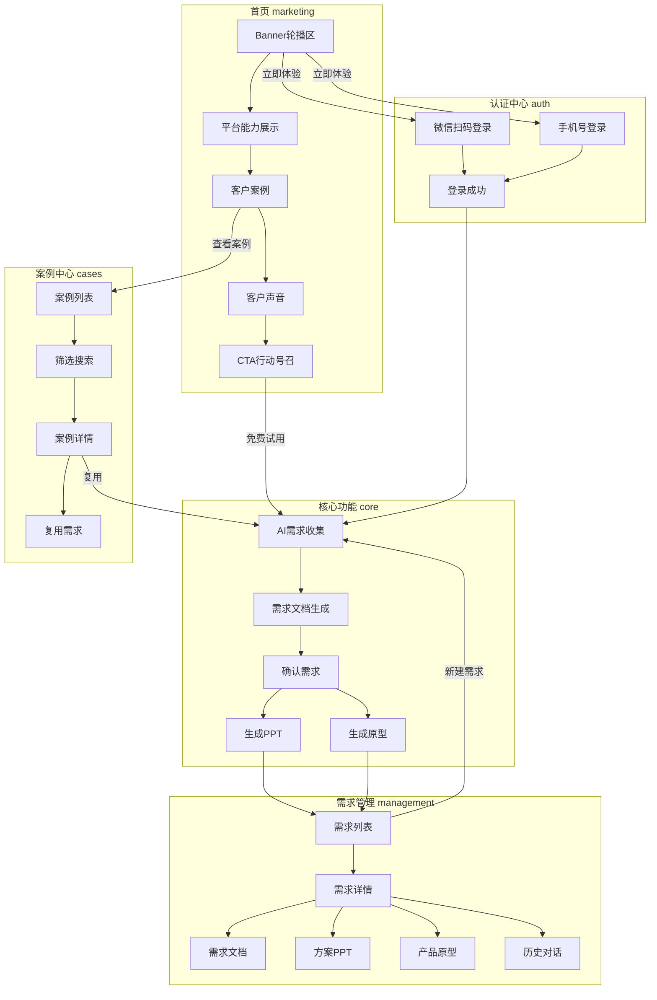
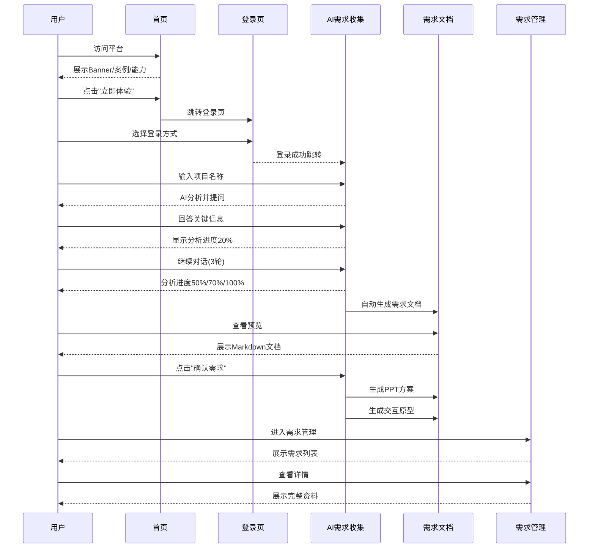
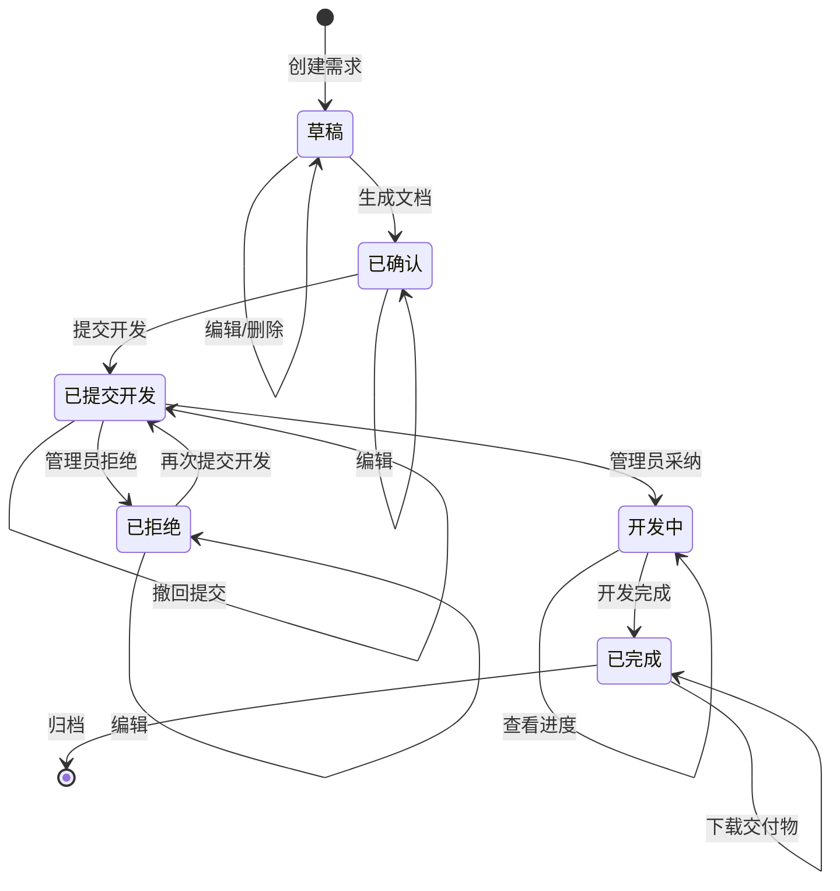
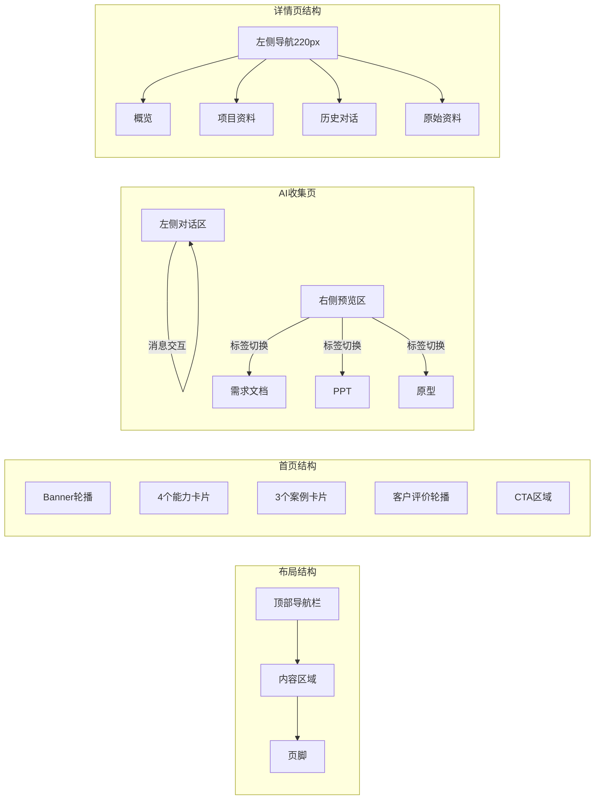
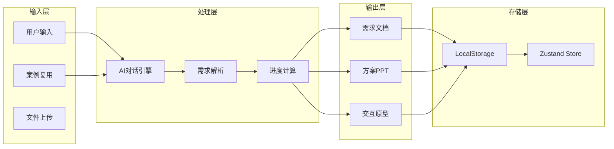
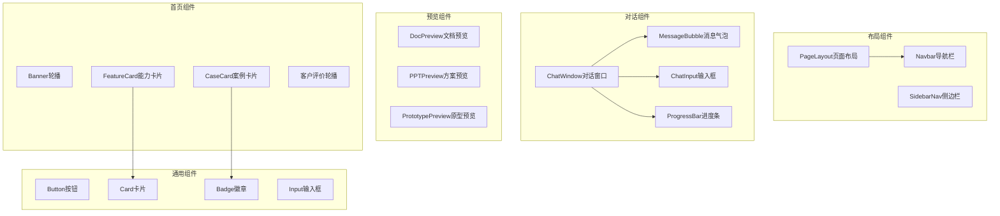
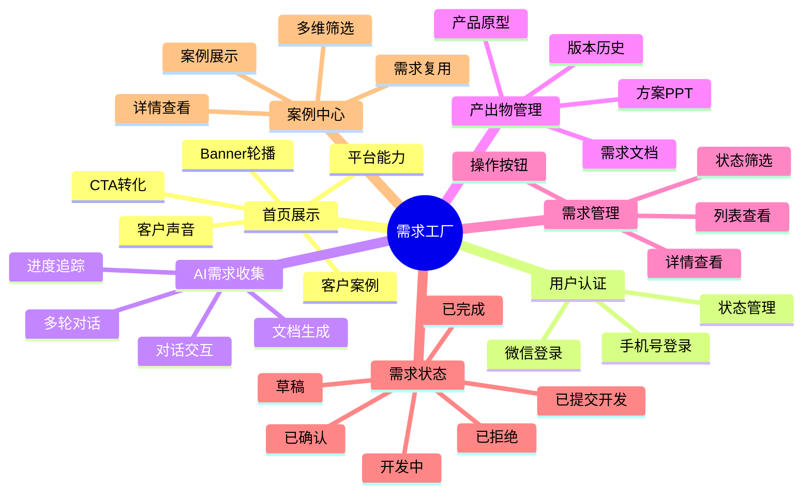

# 需求工厂原型Demo产品流程图

## 整体架构



## 用户旅程流程



## 状态流转图



### 状态说明

| 状态 | 说明 | 可用操作 |
|------|------|----------|
| **草稿** | 需求创建后初始状态 | 编辑、删除 |
| **已确认** | 需求文档已生成并确认 | 编辑、提交开发、下载产出物 |
| **已提交开发** | 已推送至管理员审核 | 撤回提交、等待审核 |
| **开发中** | 管理员已采纳，开发团队开发中 | 查看进度 |
| **已拒绝** | 管理员拒绝，需修改后重新提交 | 编辑、再次提交开发、下载产出物 |
| **已完成** | 开发完成 | 下载交付物、归档 |

### 审核流程说明

```
┌──────────────┐     提交开发      ┌────────────────┐
│   已确认     │ ──────────────▶  │  已提交开发    │
└──────────────┘                   └────────────────┘
                                          │
                              ┌───────────┴───────────┐
                              ▼                       ▼
                       ┌──────────┐           ┌──────────┐
                       │ 管理员   │           │ 管理员   │
                       │  采纳    │           │  拒绝    │
                       └──────────┘           └──────────┘
                              │                       │
                              ▼                       ▼
                       ┌──────────┐           ┌──────────┐
                       │  开发中  │           │  已拒绝  │
                       └──────────┘           └──────────┘
                                                     │
                                          编辑后再次 │ 提交开发
                                                     ▼
                                              ┌────────────────┐
                                              │  已提交开发    │
                                              └────────────────┘
```

## 页面结构图



## 数据流图



## 组件依赖图



## 路由结构图

```mermaid
graph TD
    A[/ /] --> B[HomePage首页]
    A --> C[/login] --> D[LoginPage登录]
    A --> E[/collection] --> F[AICollectionPage AI收集]
    A --> G[/requirements] --> H[RequirementsPage需求列表]
    A --> I[/requirements/:id] --> J[RequirementDetailPage需求详情]
    A --> K[/admin/requirements] --> L[RequirementManagementPage管理后台]
    A --> M[/cases] --> N[CasesPage案例列表]
    A --> O[/cases/:id] --> P[CaseDetailPage案例详情]
    
    style B fill:#e1f5fe
    style F fill:#e8f5e9
    style H fill:#fff3e0
    style J fill:#fff3e0
    style N fill:#fce4ec
    style P fill:#fce4ec
```

## 功能模块关系图



---

**说明：**
- 使用 Mermaid 语法绘制，支持在 Markdown 中直接渲染
- 包含整体架构、用户旅程、状态流转、页面结构、数据流、组件依赖、路由结构、功能模块等多个维度
- 可根据需要选择对应图表嵌入文档